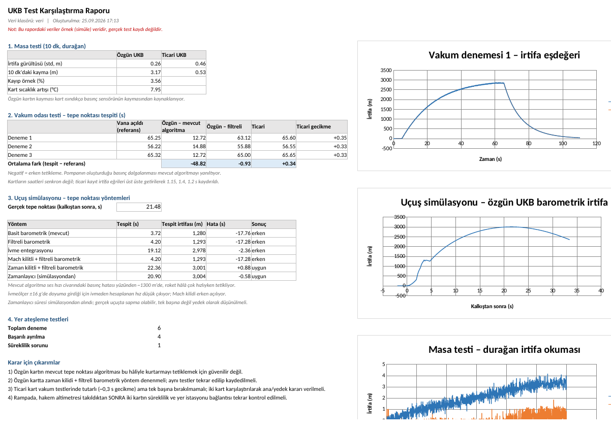
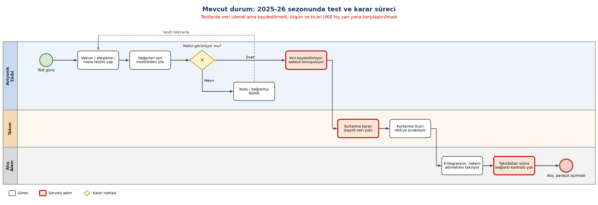
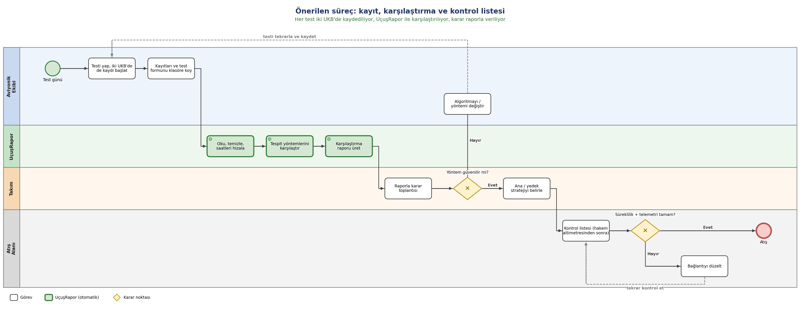

# UçuşRapor

TEKNOFEST Orta İrtifa'da yarışan ÇGM AKANA Rocket Team'de aviyonik yazılımında çalıştım. Atıştan önce vakumlama, yer ateşleme ve masa testleri yaptık ama testlerde veriyi sadece ekrandan izledik, hiçbirini kaydetmedik. Özgün uçuş bilgisayarımızla (STM32) ticari uçuş bilgisayarını hiçbir zaman aynı test üzerinden yan yana koyup karşılaştırmadık.

Sonuçta kurtarmayı neredeyse tamamen ticari karta bıraktık. Atışta ticari kartın rampada yer istasyonuyla bağlantısı kurulamadı (büyük ihtimalle hakem altimetresi takılırken bir kablo temassızlık yaptı) ve paraşüt açılmadı. Uçuş sırasında özgün kartın basınç verisinin, roket ses hızını geçerken bozulduğunu gördük; yani bizim algoritmamız da o hâliyle tepe noktasını doğru bulamayacaktı.

Geriye dönüp baktığımda asıl eksik şuydu: testleri kaydedip iki kartı karşılaştırsaydık bu sorunların çoğunu yerde görebilir, başka bir ayırma yöntemine (ya da yedek bir tetikleme mantığına) karar verebilirdik.

Bu repo o eksiği kapatmak için yazdığım küçük bir araç. İki kartın test kayıtlarını okuyor, temizliyor, saatlerini hizalıyor ve tepe noktası tespitini farklı yöntemlerle karşılaştırıp bir Excel raporu çıkarıyor.



## Ne yapıyor?

- Özgün kartın SD kayıtlarındaki bozuk / yarım satırları, kopya satırları, sensörün 0 ya da takılı döndüğü okumaları ve kayıt boşluklarını buluyor
- Ticari kartın kaydını, irtifa eğrileri üst üste gelecek şekilde kaydırarak özgün kartın saatine hizalıyor (iki kartın saati senkron değil)
- Masa testinde gürültü ve kaymayı, vakum odası testinde iki kartın tepe noktasını ne zaman bulduğunu karşılaştırıyor
- Uçuş verisi üzerinde birkaç tepe noktası yöntemini deniyor: mevcut basit barometrik, filtreli, ivme entegrasyonu, Mach kilitli, zaman kilitli ve zamanlayıcı
- Yer ateşleme testlerinde tuttuğumuz formu rapora ekliyor

## Örnek veri

Gerçek kayıtlarımız olmadığı için `veri_uret.py` ile örnek veri ürettim ve aracı bununla geliştirdim. **`veri/` klasöründeki dosyalar gerçek test ya da uçuş kaydı değil.** Örnek veriyi olabildiğince gerçekçi yapmaya çalıştım:

- uçuş profili Orta İrtifa sınıfına göre (~3 km tepe noktası, yanma sonunda ~Mach 1.1), ses hızı civarında statik basınç hatası var
- ivmeölçer ±16 g'de doyuma giriyor
- SD kartta yazma gecikmesi kaynaklı boşluklar, kopya satırlar, güç kesilince yarım kalan son satır
- kart ısındıkça basınç sensörü kayıyor
- vakum pompası odada birkaç Hz'lik basınç dalgalanması oluşturuyor

Kendi kayıtlarınla çalıştırmak için dosyaları aynı adlarla bir klasöre koyup `--veri` ile vermen yeterli.

## Kullanım

```
pip install -r requirements.txt
python ucusrapor.py
```

Rapor `rapor/UKB_karsilastirma.xlsx` olarak kaydediliyor. Örnek veriyi yeniden üretmek için `python veri_uret.py`, testler için `python -m pytest`.

Özgün kart formatı: `t_ms, basinc_pa, sicaklik_c, ax_g, ay_g, az_g, durum`
Ticari kart formatı: `zaman_s, irtifa_m, olay` (ticari kartın dışa aktarımını bu sütunlara çevirmek gerekiyor)

## Örnek veriyle çıkan sonuçlar

- Mevcut basit barometrik algoritma, vakum testlerinin üçünde de pompanın dalgalanması yüzünden ~50 s erken tetikledi; uçuşta da ses hızı civarında, ~1300 m'de tetikliyor.
- Sadece filtre eklemek yetmiyor. İvmeölçer doyuma girdiği için ivmeden hesaplanan hız düşük çıkıyor ve Mach kilidi de erken açılıyor.
- Kalkıştan sonraki ilk 10 s barometreyi yok sayan zaman kilidi + filtre, tepe noktasını ~0,9 s geç buluyor.
- Rampada, hakem altimetresi takıldıktan sonra iki kartın süreklilik ve telemetri bağlantısının tekrar kontrol edilmesi gerekiyor.

## Süreç

Mevcut durum:



Önerdiğim süreç:



Diyagramların düzenlenebilir hâlleri `docs/` klasöründeki `.drawio.svg` dosyaları; GitHub'da resim olarak görünüyor, draw.io ile açılıp düzenlenebiliyor.

## Eksikler

- Gerçek test kaydıyla henüz denenmedi. Bir sonraki test döneminde iki kartın kayıtlarını toplayıp aynı raporu çıkarmayı planlıyorum.
- Ticari kartın gerçek dışa aktarım formatına göre bir okuyucu yazılmadı, şimdilik sütunları elle çevirmek gerekiyor.
- Zaman kilidi süresi uçuş simülasyonundan seçildi, farklı bir motor ya da roket için yeniden ayarlanmalı.

---

Büşra Şen · İstanbul Medipol Üniversitesi, Yönetim Bilişim Sistemleri
