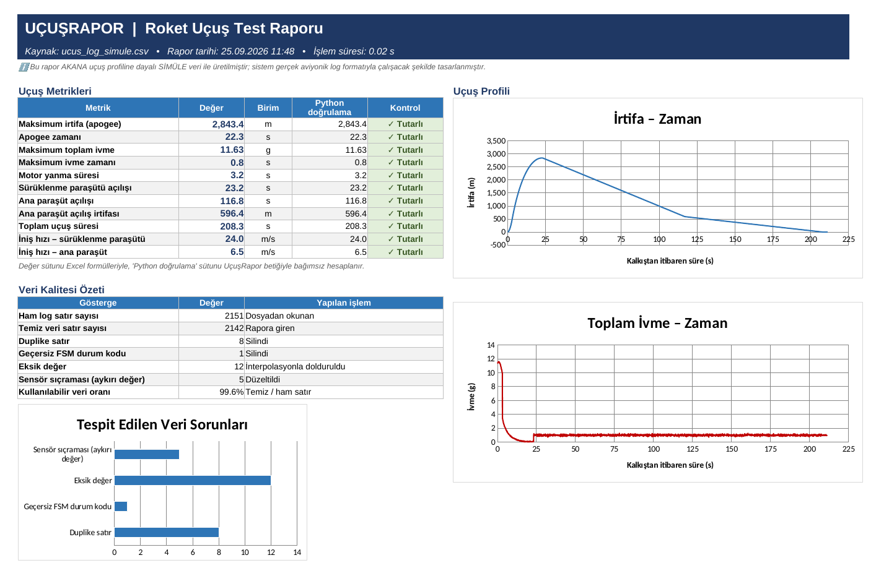
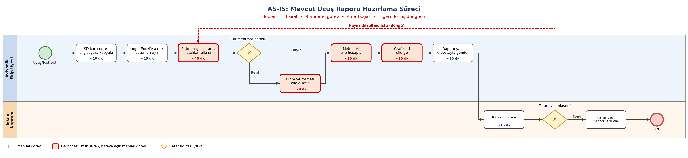
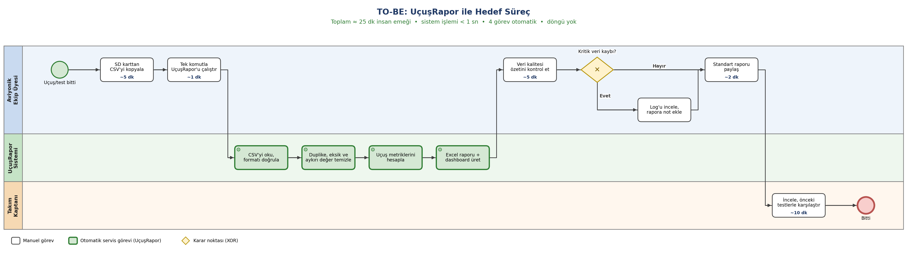

# 🚀 UçuşRapor

**Roket uçuş test verileri için otomatik raporlama sistemi**

Ham aviyonik log dosyasını tek komutla okuyan, hatalı verileri tespit edip temizleyen, temel uçuş metriklerini hesaplayan ve standart formatta bir **Excel raporu + dashboard** üreten Python aracı.

  



---

## Problem

TEKNOFEST Orta İrtifa Roket Yarışması'nda yer alan ÇGM AKANA Rocket Team'de her test veya uçuştan sonra STM32 aviyonik kartının SD karta yazdığı ham veriler elle Excel'e aktarılıp temizleniyor, metrikler elle hesaplanıyor ve grafikler elle çiziliyordu. Bu süreç:

- test başına **yaklaşık 3 saat** sürüyor,
- yanlış birim, eksik satır ve kopyala-yapıştır hatalarına açık,
- her seferinde **farklı formatta** rapor üretiyordu.

## Çözüm ve sonuç

| Gösterge | Önce (manuel) | Sonra (UçuşRapor) |
|---|---|---|
| Rapor hazırlama süresi | ~3 saat | **< 1 saniye** işlem + ~25 dk inceleme |
| Hatalı veri tespiti | Gözle kontrol | **Otomatik** (26/26 hata yakalandı) |
| Metrik hesabı | Elle | **Otomatik**, Excel formülleriyle çapraz doğrulanmış |
| Rapor formatı | Her seferinde farklı | **Tek standart şablon** |

Süreç analizi (BPMN):

| AS-IS | TO-BE |
|---|---|
|  |  |

---

## Özellikler

- **Veri doğrulama ve temizleme**
  - Duplike (tekrar eden) satırları siler
  - Geçersiz uçuş durum makinesi (FSM) kodlarını ayıklar
  - Eksik değerleri tespit edip zamana göre doğrusal interpolasyonla doldurur
  - Fiziksel olarak imkânsız sensör sıçramalarını (kayan medyan + fiziksel sınır kontrolü) yakalar
  - Her müdahaleyi satır numarası ve nedeniyle **veri kalitesi günlüğüne** yazar
- **Uçuş metrikleri:** maksimum irtifa (apogee), apogee zamanı, maksimum ivme, motor yanma süresi, paraşüt açılış anları ve irtifası, toplam uçuş süresi, iniş hızları
- **Excel raporu (4 sayfa):**
  - `Özet` — metrikler, veri kalitesi özeti ve 3 grafikli dashboard
  - `Temiz Veri` — rapora giren temizlenmiş veri
  - `Veri Kalitesi` — tespit edilen her sorun ve yapılan işlem
  - `Uçuş Olayları` — FSM aşamalarının zaman çizelgesi
- **Çift hesaplama ile doğrulama:** Rapordaki metrikler Excel formülleriyle hesaplanır ve Python sonuçlarıyla otomatik karşılaştırılır (`✓ Tutarlı`).

## Hızlı başlangıç

```bash
# 1) Bağımlılıkları kur
pip install -r requirements.txt

# 2) (İsteğe bağlı) Simüle test verisini yeniden üret
python veri_uret.py

# 3) Raporu üret
python ucusrapor.py veri/ucus_log_simule.csv
```

Örnek çıktı:

```
🚀 UçuşRapor 1.0.0
────────────────────────────────────────────────────
[1/4] Log okundu .....................  2151 satır
[2/4] Veri temizlendi ................    26 sorun işlendi
        • DUPLIKE_SATIR            8
        • EKSIK_DEGER             12
        • GECERSIZ_DURUM           1
        • SENSOR_SICRAMASI         5
[3/4] Metrikler hesaplandı
        • Maksimum irtifa ........   2843.4 m  (t = 22.3 s)
        • Maksimum ivme ..........    11.63 g
        • Sürüklenme paraşütü ....     23.2 s
        • Ana paraşüt ............    116.8 s  (596 m)
        • Toplam uçuş süresi .....    208.3 s
[4/4] Excel raporu oluşturuldu ....... rapor/ucus_log_simule_rapor.xlsx
────────────────────────────────────────────────────
✅ Tamamlandı: 0.46 saniye (hedef < 300 s)
```

Diğer seçenekler:

```bash
python ucusrapor.py log.csv --cikti rapor/Test_3.xlsx   # çıktı dosyasını belirle
python ucusrapor.py gercek_log.csv --gercek             # gerçek veri: simüle uyarısını kaldır
python ucusrapor.py --help
```

## Girdi formatı

| Sütun | Birim | Açıklama |
|---|---|---|
| `zaman_ms` | ms | Kayıt başlangıcından itibaren süre |
| `irtifa_m` | m | Barometrik irtifa (zemine göre) |
| `basinc_hPa` | hPa | Atmosfer basıncı |
| `ivme_x_g`, `ivme_y_g`, `ivme_z_g` | g | 3 eksen ivme |
| `sicaklik_C` | °C | Sıcaklık |
| `durum` | 0–7 | FSM aşaması: 0 Rampa, 1 Kalkış, 2 Motor Yanması, 3 Süzülme, 4 Apogee, 5 Sürüklenme Paraşütü, 6 Ana Paraşüt, 7 İniş |

## Testler

```bash
python -m pytest -v
```

12 otomatik test; her biri bir gereksinime (FR/NFR) ve bir test senaryosuna (TS-xx) karşılık gelir. Simüle veri setine bilerek eklenen 26 hatanın (`veri/beklenen_hatalar.json`) **tamamının yakalandığını ve hiç yanlış alarm üretilmediğini** doğrular.

## Proje yapısı

```
ucusrapor/
├── ucusrapor.py            # Komut satırı arayüzü (tek komutla çalıştırma)
├── veri_uret.py            # Hatalar enjekte edilmiş simüle uçuş verisi üretici
├── ucusrapor/
│   ├── isleme.py           # Okuma, doğrulama, temizleme, metrik hesaplama
│   └── rapor.py            # Excel raporu ve dashboard
├── tests/
│   └── test_ucusrapor.py   # Otomatik test senaryoları
├── veri/
│   ├── ucus_log_simule.csv
│   └── beklenen_hatalar.json
└── docs/                   # BPMN diyagramları (.png + düzenlenebilir .drawio)
```

## Proje yönetimi

Proje **Scrum** ile, 2 sprint halinde yürütüldü:

- **Jira:** 5 epic, 15 görev, story point tahminleme, sprint planlama
- **Confluence:** proje başlatma belgesi, gereksinim dokümanı (MoSCoW + izlenebilirlik matrisi), sprint toplantı notları, süreç analizi, test senaryoları, kullanım kılavuzu
- **draw.io:** BPMN 2.0 ile as-is / to-be süreç modelleme

## Not

Geliştirme ve testler, gerçek uçuş logu paylaşılamadığı için **AKANA uçuş profiline dayalı simüle veri** ile yapılmıştır (`veri_uret.py`). Sistem, gerçek aviyonik log formatıyla doğrudan çalışacak şekilde tasarlanmıştır.

---

**Büşra Şen** · Yönetim Bilişim Sistemleri, İstanbul Medipol Üniversitesi · ÇGM AKANA Rocket Team – Aviyonik Yazılım
