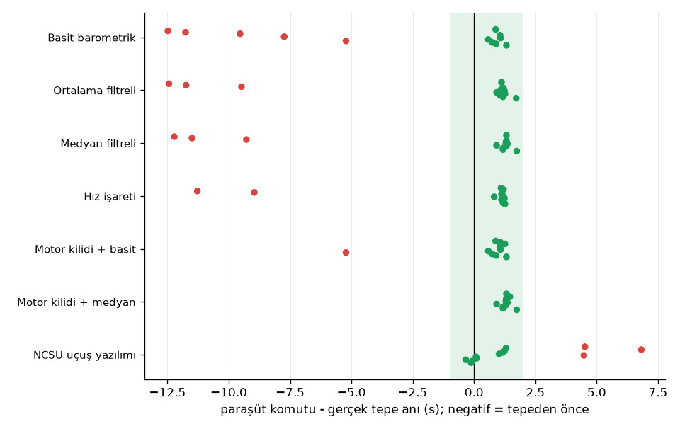
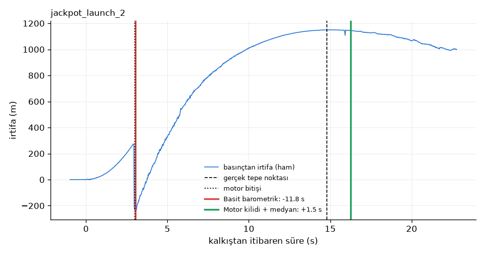

# Sonuçlar

`python ucusrapor.py` ile üretildi. Kullanılan 12 uçuş ve kaynakları
[veri/ucuslar.csv](../veri/ucuslar.csv) dosyasında.

Gecikme, paraşüt komutunun verildiği an ile gerçek tepe anı arasındaki fark
(saniye). Negatif değer, komutun tepeden önce, yani roket hâlâ yükselirken
verildiği anlamına geliyor. -1 s ile +2 s arası "zamanında" sayıldı.

## Özet

| algoritma | uçuş | zamanında | erken | geç | açılmadı | en_erken_s | en_geç_s | zamanında_ortalama_s |
|---|---|---|---|---|---|---|---|---|
| Basit barometrik | 12 | 7 | 5 | 0 | 0 | -12.48 | 1.32 | 0.94 |
| Ortalama filtreli | 12 | 9 | 3 | 0 | 0 | -12.44 | 1.72 | 1.20 |
| Medyan filtreli | 12 | 9 | 3 | 0 | 0 | -12.22 | 1.74 | 1.29 |
| Hız işareti | 12 | 10 | 2 | 0 | 0 | -11.28 | 1.26 | 1.14 |
| Motor kilidi + basit | 12 | 11 | 1 | 0 | 0 | -5.22 | 1.32 | 1.00 |
| Motor kilidi + medyan | 12 | 12 | 0 | 0 | 0 | 0.92 | 1.74 | 1.31 |
| NCSU uçuş yazılımı | 12 | 9 | 0 | 3 | 0 | -0.34 | 6.82 | 0.48 |

## Uçuş uçuş gecikmeler (s)

| uçuş | Basit barometrik | Ortalama filtreli | Medyan filtreli | Hız işareti | Motor kilidi + basit | Motor kilidi + medyan | NCSU uçuş yazılımı |
|---|---|---|---|---|---|---|---|
| genesis_launch_1 | 1.32 | 1.72 | 1.74 | 1.26 | 1.32 | 1.74 | -0.12 |
| genesis_launch_2 | 0.90 | 1.18 | 1.18 | 1.18 | 0.90 | 1.18 | -0.08 |
| legacy_launch_1 | 0.74 | 1.06 | 1.18 | 1.20 | 0.74 | 1.18 | -0.34 |
| pelicanator_launch_1 | -5.22 | 1.26 | 1.28 | 1.12 | -5.22 | 1.28 | 0.10 |
| pelicanator_launch_2 | 0.58 | 0.92 | 0.92 | 1.24 | 0.58 | 0.92 | 0.08 |
| pelicanator_launch_4 | 1.08 | 1.24 | 1.36 | 0.82 | 1.08 | 1.36 | 4.48 |
| government_work_1 | -7.74 | 1.10 | 1.30 | 1.16 | 1.06 | 1.30 | 1.02 |
| government_work_2 | 1.06 | 1.20 | 1.32 | 1.12 | 1.06 | 1.32 | 1.16 |
| jackpot_launch_1 | -9.54 | -9.48 | -9.28 | -8.96 | 1.06 | 1.32 | 1.24 |
| jackpot_launch_2 | -11.76 | -11.74 | -11.50 | -11.28 | 1.26 | 1.46 | 6.82 |
| jackpot_launch_3 | -12.48 | -12.44 | -12.22 | 1.20 | 1.08 | 1.34 | 1.30 |
| jackpot_launch_4 | 0.88 | 1.12 | 1.32 | 1.10 | 0.88 | 1.32 | 4.52 |

## Referans tepe noktası

Gerçek tepe anı, uçuştan sonra bütün kayda bakarak bulundu (irtifa 1
saniyelik ortalanmış medyanla filtrelendi, en yüksek nokta alındı). Bu
yöntemle bulunan tepe irtifası, kulübün her uçuş için bildirdiği tepe
irtifasıyla karşılaştırıldı. Süreler kalkıştan itibaren.

| uçuş | kalkıştan_tepeye_s | motor_bitişi_s | tepe_m (barometre) | tepe_m (kulübün bildirdiği) |
|---|---|---|---|---|
| genesis_launch_1 | 10.02 | 1.30 | 457.69 | 459.46 |
| genesis_launch_2 | 10.10 | 1.30 | 461.86 | 463.62 |
| legacy_launch_1 | 11.58 | 1.32 | 627.38 | 631.14 |
| pelicanator_launch_1 | 15.20 | 2.14 | 1202.70 | 1208.28 |
| pelicanator_launch_2 | 15.34 | 2.10 | 1087.20 | 1090.16 |
| pelicanator_launch_4 | 16.46 | 2.24 | 1294.66 | 1293.72 |
| government_work_1 | 9.94 | 1.70 | 494.39 | 496.16 |
| government_work_2 | 11.64 | 1.34 | 723.33 | 724.13 |
| jackpot_launch_1 | 12.58 | 3.02 | 766.04 | 762.28 |
| jackpot_launch_2 | 14.78 | 3.00 | 1149.33 | 1154.10 |
| jackpot_launch_3 | 15.54 | 3.00 | 1128.87 | 1131.20 |
| jackpot_launch_4 | 17.52 | 2.92 | 1407.54 | 1403.90 |

## Önerilen algoritmanın parametrelere hassasiyeti

Önerilen algoritmayı bu 12 uçuşa bakarak seçtim. Seçimin iki parametreye
çok hassas olup olmadığını görmek için motor bitişinden sonraki kilit
süresini ve medyan penceresini değiştirdim.

| kilit_s | medyan_penceresi_s | zamanında | en_geç_s |
|---|---|---|---|
| 0.50 | 0.30 | 12 | 1.72 |
| 0.50 | 0.50 | 12 | 1.74 |
| 0.50 | 1.00 | 10 | 2.50 |
| 1.00 | 0.30 | 12 | 1.72 |
| 1.00 | 0.50 | 12 | 1.74 |
| 1.00 | 1.00 | 10 | 2.50 |
| 2.00 | 0.30 | 12 | 1.72 |
| 2.00 | 0.50 | 12 | 1.74 |
| 2.00 | 1.00 | 10 | 2.50 |

